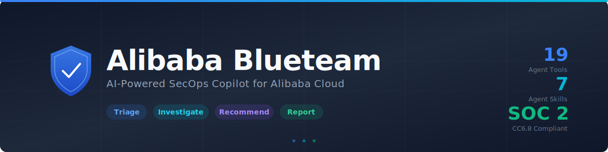
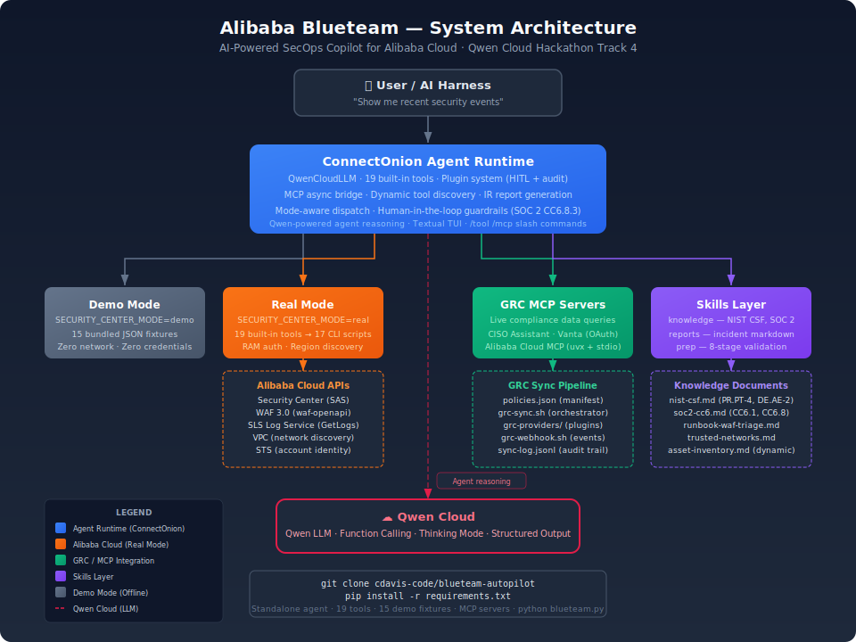

<div align="center">



*Intelligent security operations with human-in-the-loop guardrails*

**Triage** security events · **Investigate** incidents · **Recommend** responses · **Report** compliance

* SOC 2 CC6.8 compliant by design
* Dual-mode: live production & offline demo
* **Standalone Python agent** built on Qwen Cloud + ConnectOnion with function calling + thinking mode
* 17 CLI scripts · 7 agent skills · 19 agent tools · zero credentials for demo

🎬 **[Watch Demo Video](https://www.youtube.com/watch?v=-eqQJuAFHhA)**

[Getting Started ↓](#5-minute-getting-started-demo-mode) · [Real Mode Setup ↓](#real-mode-setup) · [Architecture ↓](#architecture)

</div>

---

## Quick Install

### Option A: Standalone Agent (Recommended)

A standalone Python agent built on **Qwen Cloud** and the **ConnectOnion** agent framework. Run it directly from the terminal — no AI IDE harness required.

```bash
# Clone the repository
git clone https://github.com/cdavis-code/blueteam-autopilot.git
cd blueteam-autopilot

# Install Python dependencies
pip install -r requirements.txt

# Configure your Qwen Cloud API key
cp .env.example .env
# Edit .env and add: DASHSCOPE_API_KEY="sk-..."

# Run the agent
python blueteam.py
```

The agent uses 19 registered tools (mapped to the bundled bash scripts) and enforces human-in-the-loop approval gates in code for all state-changing actions.

#### Agent Features

| Feature | Description |
|---------|-------------|
| **Function Calling** | 19 tools mapped to bash scripts with parallel tool call support and configurable max rounds (default: 20) |
| **Thinking Mode** | Qwen reasoning mode for complex orchestration; internally streamed and aggregated for maximum quality. Toggle via `ENABLE_THINKING` env var (default: enabled) |
| **Interactive TUI** | Full Textual-based terminal UI via ConnectOnion with status bar, thinking indicator, tool progress, and token/cost tracking |
| **Human-in-the-Loop** | SOC 2 CC6.8.3-compliant approval gates via ConnectOnion plugin system — state-changing actions run a dry-run preview first, then prompt for y/N confirmation |
| **Structured Output** | Formal action proposals with reasoning, risk level, and rollback plan generated via JSON response format |
| **IR Report Generation** | `generate_incident_report` tool aggregates all investigation data into structured context for comprehensive incident response reports with compliance mapping |
| **Plugin Architecture** | ConnectOnion event system: `before_each_tool` for HITL gates, `after_each_tool` for compliance audit logging with output truncation |
| **Dual Mode** | Demo mode (default) reads from fixture JSON; real mode calls live APIs — controlled by `SECURITY_CENTER_MODE` env var |
| **Custom LLM Provider** | `QwenCloudLLM` subclass with internal streaming aggregation preserving Qwen's thinking mode quality |
| **Multi-turn Conversation** | Persistent conversation history across turns with ConnectOnion's built-in context management |
| **Slash Commands** | `/help`, `/clear`, `/model`, `/mcp`, `/quit` with autocomplete in the TUI (`/mcp` shows per-server connection status and tool count) |
| **Cron / Headless Mode** | Run non-interactively via `--prompt` flag or piped stdin. Ideal for cron jobs, CI pipelines, and automation. Output goes to stdout; errors to stderr with non-zero exit code |

**Dependencies:** `connectonion>=1.0.0` and `python-dotenv` — ConnectOnion pulls in `textual`, `openai`, and `rich` transitively.

### Option B: Skills for AI IDE Harness

Install as skills for Qoder, Cursor, or other AI IDEs:

```bash
mkdir secops && cd secops
npx skills add cdavis-code/blueteam-autopilot --skill '*' -y
```

This creates a new project directory and installs all 7 agent skills (with bundled demo fixtures). Demo mode is the default, so you can start immediately with zero configuration.

---

## What It Does

Security teams using Alibaba Cloud face a constant flood of Security Center alerts, WAF logs, and vulnerability reports. Manually triaging every event takes hours — meanwhile, real attacks go uninvestigated.

**BlueTeam Autopilot** is a standalone AI agent built on Qwen Cloud that:

1. **Discovers** security events from Agentic SOC and WAF
2. **Investigates** each incident with deep-dive analysis (attack chain, CVEs, attacker IPs)
3. **Recommends** the least-disruptive effective response (IP block, host isolation, vuln patch)
4. **Proposes** structured action plans for human approval
5. **Reports** with NIST CSF and SOC 2 compliance mapping
6. **Queries** live GRC data (CISO Assistant, Vanta) for compliance context during incident response

All state-changing actions require **explicit human approval** — SOC 2 CC6.8.3 compliant by design.

---

## Two Modes at a Glance

| Mode | Network | Prerequisites | Speed | Use Case |
|------|---------|--------------|-------|----------|
| `demo` | ❌ Offline | None (agent: `DASHSCOPE_API_KEY` only) | Instant | Demos, CI, development (default) |
| `real` | ✅ Live API | `aliyun` CLI configured (`aliyun configure`) + `.env` with `SECURITY_CENTER_MODE=real` | ~1-3s per call | Production incidents |

**Demo mode is the default.** For the standalone agent, you need a Qwen Cloud API key. For real mode, the `aliyun` CLI credentials (from `aliyun configure`) are used automatically. To switch to real mode:

```bash
# .env file — only these are needed:
DASHSCOPE_API_KEY="sk-..."        # Qwen Cloud API key (required for agent)
SECURITY_CENTER_MODE=real          # Switch to live APIs
# ALIBABA_REGION="ap-southeast-1" # Optional — auto-discovered from aliyun CLI
```

---

## Cron / Automation

Run the agent non-interactively for scheduled jobs, CI pipelines, or scripted workflows:

```bash
# Single prompt via --prompt flag
python blueteam.py --prompt "Show me recent security events"

# Pipe prompt via stdin
echo "Show me recent security events" | python blueteam.py

# Combine both (concatenated with newline)
python blueteam.py --prompt "Context: check WAF" <<< "for IP 1.2.3.4"

# Redirect output to file (only the response — stderr is not captured)
python blueteam.py --prompt "Show events" > result.md

# Cron example: check events every hour
0 * * * * /path/to/blueteam.py --prompt "Check for new CRITICAL events" >> /var/log/blueteam.log 2>&1
```

**Behavior:**
- Output goes to **stdout** (clean for piping/redirecting)
- Errors and warnings go to **stderr** with non-zero exit code
- No TUI, no banner — just the agent's response
- State-changing tools (e.g., `execute_response_policy`) are auto-rejected in headless mode (no interactive approval possible)

---

## 5-Minute Getting Started (Demo Mode)

No Alibaba Cloud account? No problem. Demo mode works with zero cloud setup:

### Standalone Agent

```bash
# 1. Clone and install
git clone https://github.com/cdavis-code/blueteam-autopilot.git
cd blueteam-autopilot
pip install -r requirements.txt

# 2. Configure Qwen Cloud API key
cp .env.example .env
# Edit .env: DASHSCOPE_API_KEY="sk-..."

# 3. Run the agent and start investigating
python blueteam.py
# > Show me recent security events
# > Investigate event evt-demo-20260614-001
# > What response policies are available?
```

### AI IDE Harness (Skills)

```bash
# 1. Create a project directory and install skills
mkdir secops && cd secops
npx skills add cdavis-code/blueteam-autopilot --skill '*' -y

# 2. Start your agent harness and ask:
#    "Show me recent security events"
#    "Investigate event evt-demo-20260614-001"
#    "What response policies are available?"
#
# The agent will use bundled fixture data — no API calls, no credentials.
```

**What happens under the hood:** Demo mode is the default. The scripts read from bundled `skills/blueteam-autopilot-core/fixtures/*.json` files instead of calling Alibaba Cloud APIs. You get realistic responses with:
- 6 security events across all severity levels (CRITICAL → LOW)
- Full attack chains with CVEs (e.g., CVE-2026-1234 for RCE)
- 5 Agentic SOC response policies (IP block, host isolation, vuln patch)
- 5 ECS assets with SOC 2 scope tags
- WAF attack logs with top rules and attacker IPs
- NIST CSF and SOC 2 compliance document mappings

That's it. No credentials, no cloud account, no configuration.

---

## Real Mode Setup

For production use with live Alibaba Cloud data:

### Prerequisites

- [Python 3.10+](https://python.org) (for the standalone agent)
- [Node.js 18+](https://nodejs.org) (for `npx`, if using skills in AI IDE)
- [aliyun CLI](https://github.com/aliyun/aliyun-cli) installed
- RAM user with these policies:
  - `AliyunYundunSASReadOnlyAccess` — Security Center
  - `AliyunYundunWAFv3FullAccess` — WAF 3.0
  - `AliyunLogFullAccess` — SLS log queries
  - `AliyunVPCReadOnlyAccess` — VPC discovery
- Security Center Enterprise (4) or Ultimate (5) edition
- WAF 3.0 instance with at least one protected domain

### Quick Setup

**1. Configure `aliyun` CLI** (if not already done):

```bash
# Interactive configuration — prompts for AccessKey ID, Secret, and region
aliyun configure

# Or configure with a named profile (recommended for multiple accounts)
aliyun configure --profile blueteam

# List configured profiles
aliyun configure list

# Switch to a specific profile
aliyun configure set --profile blueteam
```

The `aliyun` CLI stores credentials in `~/.aliyun/config.json`. The agent's scripts use these credentials automatically — no need to configure them elsewhere.

**2. Create `.env`** with Qwen Cloud API key and mode:

| Variable | Purpose | Example |
|----------|---------|--------|
| `DASHSCOPE_API_KEY` | Qwen Cloud API key (required for agent) | `sk-...` |
| `SECURITY_CENTER_MODE` | Execution mode (`demo` or `real`) | `real` |
| `QWEN_BASE_URL` | DashScope API endpoint override | `https://dashscope.aliyuncs.com/compatible-mode/v1` |
| `ALIBABA_REGION` | Optional override (auto-discovered from `aliyun configure`) | `ap-southeast-1` |

```bash
# 1. Clone the repository
git clone https://github.com/cdavis-code/blueteam-autopilot.git
cd blueteam-autopilot

# 2. Install Python dependencies
pip install -r requirements.txt

# 3. Configure Qwen Cloud API key and real mode
cp .env.example .env
# Edit .env:
#   DASHSCOPE_API_KEY="sk-..."
#   SECURITY_CENTER_MODE=real

# 4. Verify your configuration
SECURITY_CENTER_MODE=real bash skills/blueteam-autopilot-ops/scripts/ping.sh

# 5. Run the agent and start investigating
python blueteam.py
# > Show me HIGH severity events from the last hour
# > Deep-dive into event evt-xxx-yyy
```

See [skills/blueteam-autopilot-prep/SKILL.md](skills/blueteam-autopilot-prep/SKILL.md) for the full environment validation procedure.

---

## What's Inside

```
.
├── README.md                          # This file
├── BUGS.md                            # Known issues and security findings
├── LICENSE                            # MIT License
├── CHANGELOG.md                       # Version history
├── .env.example                       # Environment variable template
│
├── blueteam.py                        # Entry point: python blueteam.py (wires ConnectOnion Agent + TUI) or --prompt for cron
├── requirements.txt                   # connectonion, python-dotenv
│
├── connectonion_qwen/                 # Qwen Cloud integration for ConnectOnion
│   ├── __init__.py                    # Package marker
│   ├── qwen_llm.py                   # Custom LLM provider (QwenCloudLLM)
│   ├── tools.py                       # 19 tool functions + bash script executor
│   ├── plugins.py                     # HITL approval + compliance logger plugins
│   ├── system_prompt.py               # System prompt (condensed SKILL.md + BEHAVIORS.md)
│   ├── report_models.py               # Pydantic models for IR report generation
│   └── config.py                      # .env loader + typed configuration
│
├── assets/
│   ├── banner.svg                     # Project banner
│   ├── logo.png                       # Project logo
│   ├── architecture-diagram.svg       # Architecture overview
│   └── submission/                    # Hackathon submission materials
│       ├── about.md                   # Devpost submission content
│       ├── medium-article.md          # Medium article draft
│       ├── proof-of-deployment.md     # Alibaba Cloud deployment evidence
│       ├── console-*.png              # Alibaba Cloud console screenshots
│       └── slides/                    # Demo video script + screenshots
│
└── skills/
    ├── blueteam-autopilot-core/       # Core agent: 5-behavior triage cycle
    │   ├── SKILL.md                   # Main prompt — role, tools, guardrails
    │   ├── BEHAVIORS.md               # Detailed workflow for each behavior
    │   ├── references/                # MCP tools, compliance, runbooks
    │   │
    │   └── fixtures/                  # Demo data (15 JSON files — bundled with install)
    │       ├── README.md              # Fixture map and capture instructions
    │       ├── ping.json
    │       ├── account_context.json
    │       ├── events_recent.json     # 6 security events
    │       ├── event_detail.json      # Full attack chain
    │       ├── event_detail_evt-demo-20260614-003.json  # Prompt injection test fixture
    │       ├── alerts.json
    │       ├── vulnerabilities.json   # 5 CVEs
    │       ├── vulnerability_detail.json
    │       ├── response_policies.json # 5 response policies
    │       ├── assets.json            # 5 ECS instances
    │       ├── waf_instance.json
    │       ├── waf_events.json        # WAF attack logs
    │       ├── waf_top_rules.json     # Top 10 WAF rules
    │       ├── waf_top_ips.json       # Top 10 attacker IPs
    │       └── knowledge_list.json
    │
    ├── blueteam-autopilot-ops/        # CLI operations: 17 Bash scripts
    │   ├── SKILL.md                   # Script catalog + CLI↔MCP matrix
    │   └── scripts/                   # ping.sh, list-events.sh, etc.
    │       └── _discover-region.sh    # Shared region auto-discovery helper
    │
    ├── blueteam-autopilot-prep/       # Environment validator (real mode only)
    │   ├── SKILL.md                   # 8-stage validation procedure
    │   └── scripts/                   # generate-trusted-networks.sh, etc.
    │
    ├── blueteam-autopilot-knowledge/  # Compliance docs, runbooks & GRC sync
    │   ├── SKILL.md
    │   ├── documents/                 # NIST CSF, SOC 2, runbooks, trusted networks, change mgmt policy
    │   ├── grc-providers/             # GRC integration scripts (CISO Assistant)
    │   ├── scripts/                   # fetch-knowledge.sh, grc-sync.sh, grc-webhook.sh
    │   └── policies.json              # Compliance policy definitions
    │
    ├── blueteam-autopilot-reports/    # Report generation
    │   ├── SKILL.md
    │   ├── templates/                 # Incident report, action proposal templates
    │   ├── schemas/                   # JSON schemas for structured reports
    │   └── scripts/                   # render-report.py
    │
    ├── blueteam-autopilot-compat/     # CLI compatibility validation
    │   ├── SKILL.md                   # Compatibility checker documentation
    │   ├── references/                # CLI command baseline (cli-baseline.json)
    │   └── scripts/                   # check-compat.sh (5-stage validator)
    │
    └── alibaba-security-ops/          # Standalone CLI skill (legacy/evolution)
        └── SKILL.md
```

### Skill Summary

| Skill | Purpose |
|-------|---------|
| `blueteam-autopilot-core` | AI agent workflow — 5-behavior triage cycle with guardrails; GRC MCP live query (CISO Assistant, Vanta) |
| `blueteam-autopilot-ops` | 17 CLI scripts wrapping `aliyun` commands (with demo dispatch) |
| `blueteam-autopilot-prep` | Environment validation (8-stage, real-mode only) |
| `blueteam-autopilot-knowledge` | Compliance controls, runbooks, GRC sync pipeline, trusted networks |
| `blueteam-autopilot-reports` | Markdown incident report generation with JSON schemas + `generate_incident_report` tool |
| `blueteam-autopilot-compat` | CLI compatibility validation — detects breaking changes in `aliyun` CLI commands, parameters, and response structures |
| `alibaba-security-ops` | Standalone CLI skill — project evolution reference |

---

## Architecture



<details>
<summary>Text-based architecture (fallback)</summary>

```
┌──────────────┐
│   User / TUI  │  "Show me recent security events"
│   (python     │
│    blueteam.py) │
└──────┬───────┘
       │
       ▼
┌──────────────────────────────────────────────┐
│  ConnectOnion Agent + Chat TUI                │
│  • QwenCloudLLM (custom LLM provider)         │
│  • 17 function-based tools (auto-schema)       │
│  • Thinking mode: internal stream aggregation  │
│  • Plugin: HITL approval gates (SOC 2)         │
│  • Plugin: Compliance audit logger             │
└──────┬───────────────────────────────────────┘
       │
       ├─── tools.py ──▶ bash scripts ──┬─── real mode ──▶ Alibaba Cloud APIs
       │                                 │                   (SAS, WAF, SLS)
       │                                 │
       │                                 └─── demo mode ──▶ fixtures/*.json
       │                                                     (zero network)
       │
       ├─── GRC MCP ────▶ CISO Assistant / Vanta MCP servers
       │                     (live compliance data, fallback to synced docs)
       │
       └─── Qwen Cloud ──▶ Qwen LLM (agent reasoning + tool orchestration)
```

</details>

---

## FAQ

### Do I need an Alibaba Cloud account to try this?

**No!** For the standalone agent, you only need a Qwen Cloud API key (free tier available at [dashscope-intl.aliyuncs.com](https://dashscope-intl.aliyuncs.com)). Demo mode uses bundled fixture files — no Alibaba Cloud credentials needed. For the skills (AI IDE harness), even the Qwen key is optional — the IDE provides the LLM.

### Is this production-ready?

Yes, in real mode. The agent calls the same Alibaba Cloud APIs that enterprise SOC teams use (Security Center, WAF, SLS). The `blueteam-autopilot-prep` skill validates your entire environment before use.

### Does the AI actually execute response actions?

Only with **explicit human approval**. All state-changing actions require the `--real` flag AND human confirmation. This is a hard requirement per SOC 2 CC6.8.3.

### Can I use this with my own Alibaba Cloud region?

Yes! Region is auto-discovered from your `aliyun` CLI configuration (`aliyun configure`). You can also set `ALIBABA_REGION` in `.env` to override it explicitly.

### How does the standalone agent work?

The agent (`blueteam.py`) uses the **ConnectOnion** framework to provide a full agent runtime with Textual TUI. A custom `QwenCloudLLM` provider connects to Qwen Cloud's OpenAI-compatible API, using internal streaming aggregation to preserve thinking mode quality. 19 tools are registered as plain Python functions (auto-schema from type hints), and two ConnectOnion plugins handle HITL approval gates and compliance audit logging. Slash commands, token tracking, and context management are provided by ConnectOnion's `Chat` TUI.

### How do I contribute or report issues?

Open an issue or PR on the repository. Fixture capture instructions are in the bundled [skills/blueteam-autopilot-core/fixtures/README.md](skills/blueteam-autopilot-core/fixtures/README.md).

### What's the minimum Security Center edition needed?

- **Demo mode:** None — works offline
- **Real mode (read-only):** Any edition, but Advanced+ recommended
- **Real mode (full Agentic SOC):** Enterprise (4) or Ultimate (5)

---

## License

[MIT License](LICENSE) — Copyright (c) 2026 Chris Davis
