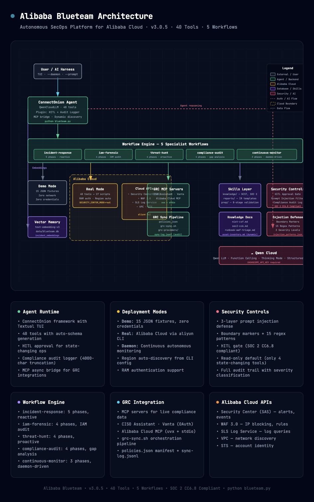

<div align="center">


*Intelligent security operations with human-in-the-loop guardrails*

**Triage** security events · **Investigate** incidents · **Recommend** responses · **Report** compliance

* SOC 2 CC6.8 compliant by design
* Dual-mode: live production & offline demo
* **Standalone Python agent** built on Qwen Cloud + ConnectOnion with function calling + thinking mode
* 40 agent tools · 5 specialist workflows · autonomous SOC daemon · zero credentials for demo

> **[About the Project](submission/about.md)** — Inspiration, architecture decisions, and technical deep-dive.

> **Primary use case:** Autonomous monitoring via `--daemon` mode for continuous security operations. The interactive TUI (default mode) is designed for ad-hoc investigation, testing, and development — not as a replacement for a full SOC dashboard.

🎬 **[Watch Demo Video](https://youtu.be/IbpzVH3cYus)** · 📊 **[View Slides](https://docs.google.com/presentation/d/e/2PACX-1vSsBonXp9VJgpyn-bjStEx8Y80QvS4sAPU4RvIrPA15Jd3LJJkaxG4agW8KyfnVXNSqmAdXhUbrx7He/pub?start=false&loop=false&delayms=3000)**

[🚀 Quick Start ↓](#-quick-start-demo-mode) · [📖 Guided Walkthrough](quick-start.md) · [What It Does ↓](#what-it-does) · [Architecture ↓](#architecture)

</div>

---

## Table of Contents

- [🚀 Quick Start (Demo Mode)](#-quick-start-demo-mode)
- [What It Does](#what-it-does)
- [Two Modes at a Glance](#two-modes-at-a-glance)
- [CLI Options](#cli-options)
- [Real Mode Setup](#real-mode-setup)
- [Cron / Automation](#cron--automation)
- [Autonomous SOC Daemon](#autonomous-soc-daemon)
- [Optional: MCP Server Integration](#optional-mcp-server-integration)
- [What's Inside](#whats-inside)
- [Architecture](#architecture)
- [Security](#security)
- [FAQ](#faq)
- [License](#license)

---

## 🚀 Quick Start (Demo Mode)

Get BlueTeam running in under 2 minutes with **zero Alibaba Cloud setup**. Demo mode uses bundled fixture data — realistic security events, attack chains, and WAF logs with no cloud account needed.

### Prerequisites

- **Python 3.10+** ([python.org](https://python.org))
- **Qwen Cloud API key** ([free tier](https://dashscope-intl.aliyuncs.com))

### Install & Run

```bash
# 1. Install the package
pip install blueteam-autopilot

# 2. Set your Qwen Cloud API key
mkdir -p ~/.blueteam && cd ~/.blueteam
echo 'DASHSCOPE_API_KEY="sk-..."' > .env

# 3. Run the agent (skills auto-download on first run)
blueteam
```

On first run, all skills and demo fixtures are automatically downloaded to `~/.blueteam/`. Subsequent runs pull updates. No manual `git clone` needed.

### Try These Prompts

Once the Textual TUI loads, type:

```
> Show me recent security events
> Investigate the most recent CRITICAL event
> What response policies are available?
> Run a compliance audit
```

### What's Happening Under the Hood

Demo mode reads from 23 bundled fixture files (`skills/blueteam-autopilot-core/fixtures/*.json`) instead of calling live Alibaba Cloud APIs. You get realistic responses with:

- 6 security events across all severity levels (CRITICAL → LOW)
- Full attack chains with CVEs (e.g., CVE-2026-1234 for RCE)
- 5 Agentic SOC response policies (IP block, host isolation, vuln patch)
- 5 ECS assets with SOC 2 scope tags
- WAF attack logs with top rules and attacker IPs
- NIST CSF and SOC 2 compliance document mappings

All 40 tools work in demo mode — threat hunting, IAM forensics, compliance audits, and incident response reports. The only difference: data comes from fixtures instead of live APIs.

### Also Available: AI IDE Skills

Prefer an AI IDE? Install as skills for Qoder, Cursor, or other IDEs — no API key needed:

```bash
npx skills add cdavis-code/blueteam-autopilot --skill '*' -y
```

That's it. Start typing `Show me recent security events` — the IDE handles the LLM.

---

## What It Does

Security teams using Alibaba Cloud face a constant flood of Security Center alerts, WAF logs, and vulnerability reports. Manually triaging every event takes hours — meanwhile, real attacks go uninvestigated.

**BlueTeam** is a standalone AI agent built on Qwen Cloud that:

1. **Discovers** security events from Agentic SOC and WAF
2. **Investigates** each incident with deep-dive analysis (attack chain, CVEs, attacker IPs)
3. **Recommends** the least-disruptive effective response (IP block, host isolation, vuln patch)
4. **Proposes** structured action plans for human approval
5. **Reports** with NIST CSF and SOC 2 compliance mapping
6. **Queries** live GRC data (CISO Assistant, Vanta) for compliance context during incident response
7. **Hunts threats** proactively via multi-phase workflows with external correlation
8. **Audits compliance** posture with control gap analysis and evidence collection
9. **Monitors autonomously** as a daemon — scanning, triaging, and escalating in real time
10. **Remembers** past incidents via vector embeddings for cross-incident similarity search

All state-changing actions require **explicit human approval** — SOC 2 CC6.8.3 compliant by design.

---

## Two Modes at a Glance

| Mode | Network | Prerequisites | Speed | Use Case |
|------|---------|--------------|-------|----------|
| `demo` | ❌ Offline | None (agent: `DASHSCOPE_API_KEY` only) | Instant | Demos, CI, development (default) |
| `real` | ✅ Live API | `aliyun` CLI configured (`aliyun configure`) + `.env` with `SECURITY_CENTER_MODE=real` | ~1-3s per call | Production incidents |

**Demo mode is the default.** For the standalone agent, you need a Qwen Cloud API key. For real mode, the `aliyun` CLI credentials (from `aliyun configure`) are used automatically. To switch to real mode:

```bash
# .env file — only these are needed:
DASHSCOPE_API_KEY="sk-..."        # Qwen Cloud API key (required for agent)
SECURITY_CENTER_MODE=real          # Switch to live APIs
# ALIBABA_REGION="ap-southeast-1" # Optional — auto-discovered from aliyun CLI
```

---

## CLI Options

| Flag | Description |
|------|-------------|
| *(none)* | Launch interactive TUI (default) |
| `--prompt` `-p` | Run non-interactively with a prompt (cron/automation mode). Output to stdout, errors to stderr |
| `--daemon` `-d` | Run as autonomous SOC daemon for continuous monitoring |
| `--interval` `-i` | Daemon polling interval in seconds (default: 60) |
| `--auto-approve <tools>` | Comma-delimited list of state-changing tools to auto-approve (no HITL). Use `none` to require HITL for all. Default: `execute_local_script`. Run `--help` for the full list |

**Default mode (no flags):** Full Textual TUI with interactive chat, slash commands, progress log, and tool tracking. By default, only `execute_local_script` is auto-approved — all other state-changing tools (e.g. `execute_response_policy`, `block_waf_ips`) still require HITL confirmation via the approval modal.

---

## Real Mode Setup

For production use with live Alibaba Cloud data:

### Prerequisites

- [Python 3.10+](https://python.org) (for the standalone agent)
- [Node.js 18+](https://nodejs.org) (for `npx`, if using skills in AI IDE)
- [aliyun CLI](https://github.com/aliyun/aliyun-cli) installed
- RAM user with these policies:
  - `AliyunYundunSASReadOnlyAccess` — Security Center
  - `AliyunYundunWAFv3FullAccess` — WAF 3.0
  - `AliyunLogFullAccess` — SLS log queries
  - `AliyunVPCReadOnlyAccess` — VPC discovery
- Security Center Enterprise (4) or Ultimate (5) edition
- WAF 3.0 instance with at least one protected domain

### Quick Setup

**1. Configure `aliyun` CLI** (if not already done):

```bash
# Interactive configuration — prompts for AccessKey ID, Secret, and region
aliyun configure

# Or configure with a named profile (recommended for multiple accounts)
aliyun configure --profile blueteam

# List configured profiles
aliyun configure list

# Switch to a specific profile
aliyun configure set --profile blueteam
```

The `aliyun` CLI stores credentials in `~/.aliyun/config.json`. The agent's scripts use these credentials automatically — no need to configure them elsewhere.

**2. Create `.env`** with Qwen Cloud API key and mode:

| Variable | Purpose | Example |
|----------|---------|--------|
| `DASHSCOPE_API_KEY` | Qwen Cloud API key (required for agent) | `sk-...` |
| `SECURITY_CENTER_MODE` | Execution mode (`demo` or `real`) | `real` |
| `QWEN_BASE_URL` | DashScope API endpoint override | `https://dashscope.aliyuncs.com/compatible-mode/v1` |
| `ALIBABA_REGION` | Optional override (auto-discovered from `aliyun configure`) | `ap-southeast-1` |

```bash
# 1. Install the package
pip install blueteam-autopilot

# 2. Configure Qwen Cloud API key and real mode
mkdir -p ~/.blueteam && cd ~/.blueteam
echo 'DASHSCOPE_API_KEY="sk-..."' > .env
echo 'SECURITY_CENTER_MODE=real' >> .env

# 3. Configure aliyun CLI (if not already done)
aliyun configure

# 4. Run the agent 
blueteam

# 5. Validate environment with the prep skill (skills auto-download on first run)
# > /blueteam-autopilot-prep

# 6. Start uing the agent 
# > Show me HIGH severity events from the last hour
# > Deep-dive into event evt-xxx-yyy
```

See [skills/blueteam-autopilot-prep/SKILL.md](skills/blueteam-autopilot-prep/SKILL.md) for the full environment validation procedure.

---

## Cron / Automation

Run the agent non-interactively for scheduled jobs, CI pipelines, or scripted workflows:

```bash
# Single prompt via --prompt flag
python blueteam.py --prompt "Show me recent security events"

# Pipe prompt via stdin
echo "Show me recent security events" | python blueteam.py

# Combine both (concatenated with newline)
python blueteam.py --prompt "Context: check WAF" <<< "for IP 1.2.3.4"

# Redirect output to file (only the response — stderr is not captured)
python blueteam.py --prompt "Show events" > result.md

# Cron example: check events every hour
0 * * * * /path/to/blueteam.py --prompt "Check for new CRITICAL events" >> /var/log/blueteam.log 2>&1
```

**Behavior:**
- Output goes to **stdout** (clean for piping/redirecting)
- Errors and warnings go to **stderr** with non-zero exit code
- No TUI, no banner — just the agent's response
- State-changing tools (e.g., `execute_response_policy`) are auto-rejected in headless mode (no interactive approval possible)

---

## Autonomous SOC Daemon

Run the agent as a continuous monitoring daemon that watches for threats 24/7:

```bash
# Start daemon with 60-second polling interval (default)
python blueteam.py --daemon

# Custom interval (30 seconds)
python blueteam.py --daemon --interval 30

# Short flags
python blueteam.py -d -i 30
```

**What happens each tick:**
1. **Scan** — Fetch new security events since the last check (last hour on first run)
2. **Triage** — Classify by severity, check similarity against institutional memory
3. **Escalate** — Store findings, update monitor state, print escalation summary

**Console output:**
- CRITICAL/HIGH escalations highlighted in red with full context
- MEDIUM events logged but not escalated
- LOW events counted only
- "All clear" in green when no new events
- Graceful shutdown on Ctrl+C with uptime summary

**State persistence:** Monitor state (last check timestamp, tick count, escalation count) is stored in `data/blueteam.db` and survives restarts.

---

## Optional: MCP Server Integration

The agent dynamically discovers tools from external MCP (Model Context Protocol) servers at startup. MCP servers provide live GRC data, ticketing integrations, and additional cloud services.

### Configuration

Copy the example config and customize it:

```bash
cp .mcp.example.json .mcp.json
# Edit .mcp.json to enable/configure MCP servers
```

The `.mcp.example.json` includes presets for:
- **CISO Assistant** — Live GRC framework data (stdtio, via `npx`)
- **Vanta** — Compliance posture (SSE)
- **Alibaba Cloud Ops** — Extended cloud operations (stdtio, via `uvx`)
- **DFIR-IRIS** — Incident response ticketing (stdtio, via `uv`)
- **Atlassian** — Jira/Confluence integration (SSE)

### Environment Variables

| Variable | Purpose | Default |
|----------|---------|---------|
| `MCP_CONFIG_PATH` | Path to MCP server config file | `.mcp.json` |

### Behavior

- **Optional** — If `.mcp.json` is missing or servers are unreachable, the agent skips MCP tools and uses synced knowledge documents as fallback
- **Dynamic discovery** — Tools from connected MCP servers are automatically registered and available to the agent
- **Status command** — Use `/mcp` in the TUI to see per-server connection status and tool count

---

## What's Inside

```
.
├── README.md                          # This file
├── SECURITY.md                        # Security controls reference
├── BUGS.md                            # Known issues and security findings
├── LICENSE                            # MIT License
├── CHANGELOG.md                       # Version history
├── .env.example                       # Environment variable template
├── .mcp.example.json                  # MCP server config template (CISO Assistant, Vanta, etc.)
│
├── blueteam.py                        # Entry point: TUI, --prompt (cron), --daemon (autonomous SOC)
├── requirements.txt                   # connectonion, python-dotenv
│
├── connectonion_qwen/                 # Qwen Cloud integration for ConnectOnion
│   ├── __init__.py                    # Package marker
│   ├── qwen_llm.py                   # Custom LLM provider (QwenCloudLLM)
│   ├── tools.py                       # 40 tool functions + Python script executor
│   ├── plugins.py                     # 3 plugins: HITL approval, TUI result capture, compliance logger
│   ├── system_prompt.py               # Auto-delegation system prompt (routes to workflows)
│   ├── report_models.py               # Pydantic models for IR report generation
│   ├── embeddings.py                  # Vector embeddings (DashScope text-embedding-v3)
│   ├── memory.py                      # Persistent SQLite/libSQL database
│   ├── mcp.py                         # MCP client bridge for GRC/ticketing servers
│   ├── config.py                      # .env loader + typed configuration + Alibaba env auto-discovery
│   └── providers/                     # Multi-cloud provider components
│       ├── aliyun/                    # Alibaba Cloud tools (40)
│       └── aws/                       # AWS tools (13)
│
├── workflows/                         # Multi-agent workflow engine
│   ├── _engine/                       # Engine core (parser.py, runner.py, context.py)
│   ├── incident-response/             # 5-phase reactive incident handling
│   ├── iam-forensic/                  # 4-phase IAM security audit
│   ├── threat-hunt/                   # 4-phase proactive threat hunting
│   ├── compliance-audit/              # 4-phase compliance gap analysis
│   └── continuous-monitor/            # 3-phase autonomous SOC monitoring
│
├── assets/
│   ├── banner.svg                     # Project banner
│   ├── logo.png                       # Project logo
│   ├── blueteam-architecture.html     # Interactive architecture diagram (open in browser)
│   ├── blueteam-architecture.png      # Architecture diagram (PNG export)
│   └── submission/                    # Hackathon submission materials
│       ├── about.md                   # Devpost submission content
│       ├── medium-article.md          # Medium article draft
│       ├── proof-of-deployment.md     # Alibaba Cloud deployment evidence
│       ├── console-*.png              # Alibaba Cloud console screenshots
│       └── slides/                    # Demo video script + screenshots
│
├── blueteam_data/                     # Thin Python package (symlinks to skills/)
│   ├── __init__.py
│   ├── scripts -> ../skills/blueteam-autopilot-ops/scripts
│   ├── fixtures -> ../skills/blueteam-autopilot-core/fixtures
│   └── knowledge -> ../skills/blueteam-autopilot-knowledge/knowledge
│
└── skills/                            # Canonical location for all runtime data
    ├── blueteam-autopilot-core/       # Core agent: role, tools, guardrails
    │   ├── SKILL.md                   # Main prompt — role, tools, guardrails
    │   ├── BEHAVIORS.md               # Detailed workflow for each behavior
    │   ├── references/                # MCP tools, compliance, runbooks
    │   └── fixtures/                  # 23 demo fixture JSON files (default mode)
    │
    ├── blueteam-autopilot-ops/        # CLI operations
    │   ├── SKILL.md                   # Script catalog + CLI↔MCP matrix
    │   └── scripts/                   # 31 Python scripts (demo vs. real dispatch, cross-platform)
    │
    ├── blueteam-autopilot-prep/       # Environment validator (real mode only)
    │   ├── SKILL.md                   # 8-stage validation procedure
    │   └── scripts/                   # generate_trusted_networks.py, etc.
    │
    ├── blueteam-autopilot-knowledge/  # Compliance docs, runbooks & GRC sync
    │   ├── SKILL.md
    │   ├── documents/                 # NIST CSF, SOC 2, runbooks, trusted networks
    │   ├── grc-providers/             # GRC integration scripts (CISO Assistant)
    │   ├── scripts/                   # fetch_knowledge.py, grc_sync.py
    │   ├── knowledge/                 # Runtime knowledge docs (NIST CSF, SOC 2, etc.)
    │   └── policies.json              # Compliance policy definitions
    │
    ├── blueteam-autopilot-reports/    # Report generation
    │   ├── SKILL.md
    │   ├── templates/                 # Incident report, action proposal templates
    │   ├── schemas/                   # JSON schemas for structured reports
    │   └── scripts/                   # render-report.py
    │
    ├── blueteam-autopilot-compat/     # CLI compatibility validation
    │   ├── SKILL.md                   # Compatibility checker documentation
    │   ├── references/                # CLI command baseline (cli-baseline.json)
    │   └── scripts/                   # check_compat.py (5-stage validator)
    │
    └── alibaba-security-ops/          # Standalone CLI skill (legacy/evolution)
        └── SKILL.md
```

### Skill Summary

| Skill | Purpose |
|-------|---------|
| `blueteam-autopilot-core` | AI agent workflow — 5-behavior triage cycle with guardrails; GRC MCP live query (CISO Assistant, Vanta) |
| `blueteam-autopilot-ops` | 31 Python scripts wrapping `aliyun` commands (cross-platform, demo dispatch) |
| `blueteam-autopilot-prep` | Environment validation (8-stage, real-mode only) |
| `blueteam-autopilot-knowledge` | Compliance controls, runbooks, GRC sync pipeline, trusted networks |
| `blueteam-autopilot-reports` | Markdown incident report generation with JSON schemas + `generate_incident_report` tool |
| `blueteam-autopilot-compat` | CLI compatibility validation — detects breaking changes in `aliyun` CLI commands, parameters, and response structures |
| `alibaba-security-ops` | Standalone CLI skill — project evolution reference |

---

## Architecture



<details>
<summary>Text-based architecture (fallback)</summary>

```
┌──────────────┐
│   User / TUI  │  "Show me recent security events"
│   (python     │
│    blueteam.py) │
└──────┬───────┘
       │
       ▼
┌──────────────────────────────────────────────┐
│  ConnectOnion Agent + Chat TUI                │
│  • QwenCloudLLM (custom LLM provider)         │
│  • 40 function-based tools (auto-schema)       │
│  • Thinking mode: internal stream aggregation  │
│  • Plugin: HITL approval gates (SOC 2)         │
│  • Plugin: TUI result capture                  │
│  • Plugin: Compliance audit logger            │
│  • Auto-delegation → 5 specialist workflows    │
└──────┬───────────────────────────────────────┘
       │
       ├─── tools.py ──▶ Python scripts ──┬─── real mode ──▶ Alibaba Cloud APIs
       │                                 │                   (SAS, WAF, SLS)
       │                                 │
       │                                 └─── demo mode ──▶ fixtures/*.json
       │                                                     (zero network)
       │
       ├─── workflows/ ──▶ 5 specialist workflows
       │   ├── incident-response (5 phases)
       │   ├── iam-forensic (4 phases)
       │   ├── threat-hunt (4 phases)
       │   ├── compliance-audit (4 phases)
       │   └── continuous-monitor (3 phases, daemon-driven)
       │
       ├─── embeddings.py ──▶ DashScope text-embedding-v3
       │   └── data/blueteam.db (SQLite: incident_embeddings + monitor_state)
       │
       ├─── GRC MCP ────▶ CISO Assistant / Vanta MCP servers
       │                     (live compliance data, fallback to synced docs)
       │
       └─── Qwen Cloud ──▶ Qwen LLM (agent reasoning + tool orchestration)
```

</details>

---

## Security

BlueTeam implements defense-in-depth security controls to protect against prompt injection, unauthorized actions, and supply chain attacks:

- **Prompt injection prevention** — Three-layer defense: boundary markers (`[TOOL OUTPUT START/END]`), configurable pattern-based input filtering (15 detection patterns across critical/high/medium severities), and system prompt guardrails that instruct the LLM to treat all tool output as untrusted data
- **Human-in-the-loop enforcement** — Seven state-changing tools require explicit operator approval via dry-run preview + y/N confirmation (SOC 2 CC6.8.3). Workflow phases declare `requires-hitl: true` to enforce the gate on sub-agents
- **Audit trail** — Every tool execution is logged with UTC timestamp, arguments, status, and timing. Injection detections are audited with full match context
- **Supply chain protection** — GRC document sync requires human review (diff + confirmation) before writing server responses to knowledge documents
- **Credential protection** — Secrets are never exposed in tool output; credential exfil patterns are detected and redacted

See [SECURITY.md](SECURITY.md) for the full security control reference, threat model, and compliance mapping.

---

## FAQ

### Do I need an Alibaba Cloud account to try this?

**No!** For the standalone agent, you only need a Qwen Cloud API key (free tier available at [dashscope-intl.aliyuncs.com](https://dashscope-intl.aliyuncs.com)). Demo mode uses bundled fixture files — no Alibaba Cloud credentials needed. For the skills (AI IDE harness), even the Qwen key is optional — the IDE provides the LLM.

### Is this production-ready?

Yes, in real mode. The agent calls the same Alibaba Cloud APIs that enterprise SOC teams use (Security Center, WAF, SLS). The `blueteam-autopilot-prep` skill validates your entire environment before use.

### Does the AI actually execute response actions?

Only with **explicit human approval**. All state-changing actions require the `--real` flag AND human confirmation. This is a hard requirement per SOC 2 CC6.8.3.

### Can I use this with my own Alibaba Cloud region?

Yes! Region is auto-discovered from your `aliyun` CLI configuration (`aliyun configure`). You can also set `ALIBABA_REGION` in `.env` to override it explicitly.

### How does the standalone agent work?

The agent (`blueteam.py`) uses the **ConnectOnion** framework to provide a full agent runtime with Textual TUI. A custom `QwenCloudLLM` provider connects to Qwen Cloud's OpenAI-compatible API, using internal streaming aggregation to preserve thinking mode quality. 40 tools are registered as plain Python functions (auto-schema from type hints), and three ConnectOnion plugins handle HITL approval gates, TUI result capture, and compliance audit logging. Complex investigations are auto-delegated to 5 specialist workflows (incident-response, iam-forensic, threat-hunt, compliance-audit, continuous-monitor), each running as a sequence of phase-scoped agents with restricted tool sets. Vector embeddings (DashScope text-embedding-v3) enable cross-incident similarity search. The `--daemon` flag enables autonomous SOC monitoring.

### How do I contribute or report issues?

Open an issue or PR on the repository. Fixture capture instructions are in the bundled [skills/blueteam-autopilot-core/fixtures/README.md](skills/blueteam-autopilot-core/fixtures/README.md).

### What's the minimum Security Center edition needed?

- **Demo mode:** None — only requires Qwen Cloud API key for LLM
- **Real mode (read-only):** Any edition, but Advanced+ recommended
- **Real mode (full Agentic SOC):** Enterprise (4) or Ultimate (5)

---

## License

[MIT License](LICENSE) — Copyright (c) 2026 Chris Davis
