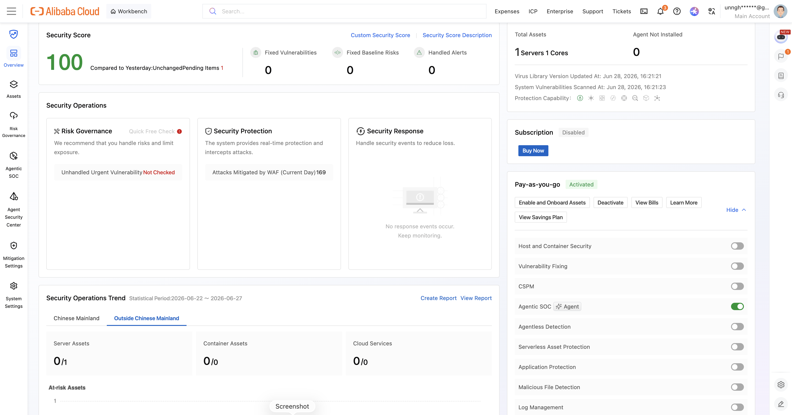
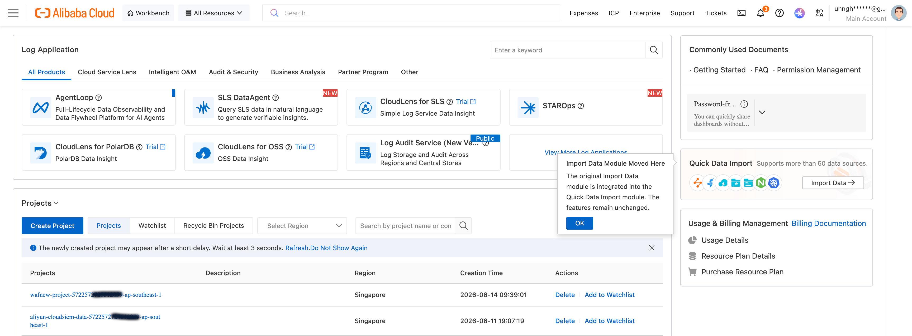
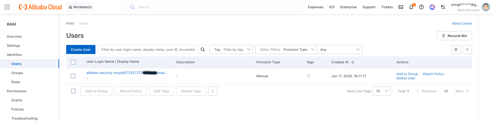

# Proof of Alibaba Cloud Deployment

This document demonstrates that Alibaba Blueteam's backend runs on Alibaba Cloud services and APIs. It provides environment configuration, live API evidence, console screenshots, and direct links to the code files that call each Alibaba Cloud API.

---

## 1. Alibaba Cloud Services Used

| Service | API Product | Purpose |
|---------|------------|---------|
| Security Center (SAS) | `sas` | Security events, alerts, vulnerabilities, asset inventory |
| WAF 3.0 | `waf-openapi` | WAF instance discovery, attack logs, top rules, top attacker IPs |
| Simple Log Service (SLS) | `sls` | WAF log queries, project/logstore discovery, log delivery verification |
| Virtual Private Cloud (VPC) | `vpc` | Network discovery, VPC attributes, VPN gateway enumeration |
| Security Token Service (STS) | `sts` | Account identity discovery (GetCallerIdentity) |

---

## 2. Environment Configuration

The project uses a `.env` file for the Qwen Cloud API key and execution mode. Alibaba Cloud credentials are managed separately by the `aliyun` CLI (stored in `~/.aliyun/config.json`):

```bash
# .env — Qwen Cloud API key (required) and execution mode
DASHSCOPE_API_KEY="sk-••••••••••••••••"
SECURITY_CENTER_MODE=real

# Alibaba Cloud credentials are NOT in .env
# They are configured via: aliyun configure
# Stored in: ~/.aliyun/config.json
# Region auto-discovered from CLI config (ap-southeast-1)
```

**What this proves:**
- Real Qwen Cloud API key was configured for the agent's LLM backend
- The project was tested in `real` mode (live API calls, not demo fixtures)
- Alibaba Cloud credentials managed via `aliyun configure` (RAM user `alibaba-security-mcp`)
- Region `ap-southeast-1` (Singapore) auto-discovered from CLI config

---

## 3. Live API Evidence

### Environment Readiness Report (blueteam-autopilot-prep)

The project includes an 8-stage environment validator that discovers and verifies all Alibaba Cloud resources. Running this skill against a live environment produces:

**BlueTeam Autopilot - Environment Readiness Report**

| Item | Value |
|------|-------|
| Region | ap-southeast-1 |
| Account ID | 572257•••••••••• |
| RAM User | alibaba-security-mcp |
| Checked | 2026-06-28 |

**Validation Results:**

| Stage | Check | Status | Notes |
|-------|-------|--------|-------|
| 1 | aliyun CLI | PASS | v3.4.2 |
| 2 | Credentials | PASS | RAMUser authenticated |
| 3 | RAM Permissions | PASS | All 4 required policies attached (+ AliyunRAMReadOnlyAccess, AliyunYundunWAFFullAccess bonus) |
| 4a | Security Center | PASS | Active (postpay), Version 1 (Basic) |
| 4b | Agentic SOC | WARN | Edition 1 = Basic. Agentic SOC requires Enterprise (4+) or Ultimate (5) |
| 4c | WAF 3.0 | PASS | Instance waf_v2intl_public_intl-sg-2ci4toerd01, POSTPAY |
| 4d | WAF CNAME (DNS) | PASS | ecs.muayid.com -> *.aliyunwaf5.com |
| 4e | SLS | PASS | 2 projects, WAF project present |
| 5a | WAF Domains | PASS | 1 domain: ecs.muayid.com (Status: Active) |
| 5b | WAF Log Delivery | PASS | Logs flowing to SLS (API transient 403, verified via SLS directly) |
| 5c | SLS Project/Logstore | PASS | wafnew-logstore with v2 index |
| 5d | Domain-level Logs | PASS | Confirmed logs arriving from ecs.muayid.com |
| 5e | SOC Detection Rules | N/A | Requires Enterprise edition - cannot verify |
| 6 | End-to-End Test | PASS | SQLi attack blocked (405), log confirmed in SLS |
| 7a | Generate Configs | PASS | trusted-networks.md auto-generated (1 VPC, 0 VPN) |
| 7b | Validate Config | PASS | No hardcoded values detected |
| 7c | GRC Policy Config | SKIP | Optional - not configured |

### Security Center (SAS) — Event Query

Command executed against live Alibaba Cloud APIs:

```bash
$ source .env && aliyun sas describe-susp-events \
    --region "$ALIBABA_REGION" \
    --time-range 7

{
    "Count": 0,
    "CurrentPage": 1,
    "PageSize": 20,
    "RequestId": "E93EF95D-C416-34B7-823B-ED2E304595BC",
    "SuspEvents": [],
    "TotalCount": 0
}
```

**What this proves:**
- Security Center API is accessible and authenticated (valid `RequestId` returned)
- RAM user has valid permissions (AliyunYundunSASReadOnlyAccess)
- The API returned a valid response structure
- Empty result is expected: Basic edition (Version 1) does not generate advanced security events

### WAF 3.0 — Instance Discovery

```bash
$ source .env && aliyun waf-openapi describe-instance \
    --region "$ALIBABA_REGION" | jq '{
        InstanceId: .InstanceId,
        Edition: .Edition,
        Status: .Status,
        Region: .AllDetails.region,
        PayType: .PayType,
        ExpireTime: .ExpireTime,
        RemainingDays: .RemainDay
    }'
{
  "InstanceId": "waf_v2intl_public_intl-sg-2ci4toerd01",
  "Edition": "default_version",
  "Status": 1,
  "Region": "ap-southeast-1",
  "PayType": "POSTPAY",
  "ExpireTime": null,
  "RemainingDays": null
}
```

**What this proves:**
- WAF 3.0 instance is active (Status: 1)
- Pay-as-you-go (POSTPAY) billing model
- Region: `ap-southeast-1` (Singapore)

### Simple Log Service (SLS) — Log Query

```bash
$ source .env && aliyun sls GetLogs \
    --project "wafnew-project-${ACCOUNT_ID}-$ALIBABA_REGION" \
    --logstore wafnew-logstore \
    --from $(date -v-1H +%s) \
    --to $(date +%s) \
    --query "* | SELECT count(*) as total"

[
    {
        "__source__": "",
        "__time__": "1782673338",
        "total": "128"
    }
]
```

**What this proves:**
- SLS log project exists and is accessible
- WAF logs are being delivered to SLS (128 entries in the last hour)
- Log query functionality works end-to-end

---

## 4. Alibaba Cloud Console Evidence

### Security Center Console



*Screenshot showing Security Center dashboard with events and real-time protection.*

### WAF 3.0 Console


*Screenshot showing WAF 3.0 instance with protected domains, attack logs, and rule configuration.*

### SLS Console



*Screenshot showing the SLS project with active logstore and recent query history.*

### RAM Console



*Screenshot showing the RAM user with attached policies: AliyunYundunSASReadOnlyAccess, AliyunYundunWAFv3FullAccess, AliyunLogFullAccess, AliyunVPCReadOnlyAccess.*

---

## 5. Code Files Demonstrating Alibaba Cloud API Usage

### 1. Security Center (SAS) APIs

| File | API Call | Line |
|------|----------|------|
| [list-events.sh](https://github.com/cdavis-code/blueteam-autopilot/blob/main/skills/blueteam-autopilot-ops/scripts/list-events.sh) | `aliyun sas describe-susp-events` | L49, L55 |
| [get-event-detail.sh](https://github.com/cdavis-code/blueteam-autopilot/blob/main/skills/blueteam-autopilot-ops/scripts/get-event-detail.sh) | `aliyun sas describe-susp-event-detail` | L49 |
| [list-alerts.sh](https://github.com/cdavis-code/blueteam-autopilot/blob/main/skills/blueteam-autopilot-ops/scripts/list-alerts.sh) | `aliyun sas describe-susp-event-detail` | L45 |
| [list-vulnerabilities.sh](https://github.com/cdavis-code/blueteam-autopilot/blob/main/skills/blueteam-autopilot-ops/scripts/list-vulnerabilities.sh) | `aliyun sas describe-vul-list` | L56 |
| [get-vulnerability-detail.sh](https://github.com/cdavis-code/blueteam-autopilot/blob/main/skills/blueteam-autopilot-ops/scripts/get-vulnerability-detail.sh) | `aliyun sas describe-vul-details` | L45 |
| [get-account-context.sh](https://github.com/cdavis-code/blueteam-autopilot/blob/main/skills/blueteam-autopilot-ops/scripts/get-account-context.sh) | `aliyun sas describe-version-config` | L40 |

### 2. WAF 3.0 APIs

| File | API Call | Line |
|------|----------|------|
| [get-waf-instance.sh](https://github.com/cdavis-code/blueteam-autopilot/blob/main/skills/blueteam-autopilot-ops/scripts/get-waf-instance.sh) | `aliyun waf-openapi describe-instance` | L37 |
| [list-waf-top-rules.sh](https://github.com/cdavis-code/blueteam-autopilot/blob/main/skills/blueteam-autopilot-ops/scripts/list-waf-top-rules.sh) | `aliyun waf-openapi describe-rule-hits-top-rule-id` | L88 |
| [list-waf-top-ips.sh](https://github.com/cdavis-code/blueteam-autopilot/blob/main/skills/blueteam-autopilot-ops/scripts/list-waf-top-ips.sh) | `aliyun waf-openapi describe-rule-hits-top-client-ip` | L88 |

### 3. Simple Log Service (SLS) APIs

| File | API Call | Line |
|------|----------|------|
| [list-waf-events.sh](https://github.com/cdavis-code/blueteam-autopilot/blob/main/skills/blueteam-autopilot-ops/scripts/list-waf-events.sh) | `aliyun sls GetLogs` | L91 |
| [verify-log-delivery.sh](https://github.com/cdavis-code/blueteam-autopilot/blob/main/skills/blueteam-autopilot-ops/scripts/verify-log-delivery.sh) | `aliyun sls GetProject`, `aliyun sls ListLogStores` | L64, L87 |
| [generate-trusted-networks.sh](https://github.com/cdavis-code/blueteam-autopilot/blob/main/skills/blueteam-autopilot-prep/scripts/generate-trusted-networks.sh) | `aliyun sls GetLogs` | L371 |

### 4. VPC APIs

| File | API Call | Line |
|------|----------|------|
| [generate-trusted-networks.sh](https://github.com/cdavis-code/blueteam-autopilot/blob/main/skills/blueteam-autopilot-prep/scripts/generate-trusted-networks.sh) | `aliyun vpc DescribeVpcs` | L87 |
| [generate-trusted-networks.sh](https://github.com/cdavis-code/blueteam-autopilot/blob/main/skills/blueteam-autopilot-prep/scripts/generate-trusted-networks.sh) | `aliyun vpc DescribeVpcAttribute` | L105 |
| [generate-trusted-networks.sh](https://github.com/cdavis-code/blueteam-autopilot/blob/main/skills/blueteam-autopilot-prep/scripts/generate-trusted-networks.sh) | `aliyun vpc DescribeVpnGateways` | L140 |

### 5. STS APIs

| File | API Call | Line |
|------|----------|------|
| [list-waf-events.sh](https://github.com/cdavis-code/blueteam-autopilot/blob/main/skills/blueteam-autopilot-ops/scripts/list-waf-events.sh) | `aliyun sts GetCallerIdentity` | L36 |
| [verify-log-delivery.sh](https://github.com/cdavis-code/blueteam-autopilot/blob/main/skills/blueteam-autopilot-ops/scripts/verify-log-delivery.sh) | `aliyun sts GetCallerIdentity` | L41 |

### 6. WAF 3.0 Extended APIs (prep skill)

| File | API Call | Line |
|------|----------|------|
| [SKILL.md](https://github.com/cdavis-code/blueteam-autopilot/blob/main/skills/blueteam-autopilot-prep/SKILL.md) | `aliyun waf-openapi describe-instance` | L342 |
| [SKILL.md](https://github.com/cdavis-code/blueteam-autopilot/blob/main/skills/blueteam-autopilot-prep/SKILL.md) | `aliyun waf-openapi describe-domains` | L410 |
| [SKILL.md](https://github.com/cdavis-code/blueteam-autopilot/blob/main/skills/blueteam-autopilot-prep/SKILL.md) | `aliyun waf-openapi describe-log-service-status` | L429 |
| [SKILL.md](https://github.com/cdavis-code/blueteam-autopilot/blob/main/skills/blueteam-autopilot-prep/SKILL.md) | `aliyun waf-openapi describe-resource-log-status` | L437 |
| [SKILL.md](https://github.com/cdavis-code/blueteam-autopilot/blob/main/skills/blueteam-autopilot-prep/SKILL.md) | `aliyun waf-openapi modify-resource-log-status` | L451 |

> **Note on API naming conventions:** WAF commands use lowercase-hyphenated names (e.g., `describe-instance`). Parameters follow API version conventions: newer APIs (2021-10-01) use PascalCase (`--InstanceId`), older APIs (2019-09-10) use kebab-case (`--instance-id`). See [api-naming.md](https://github.com/cdavis-code/blueteam-autopilot/blob/main/skills/blueteam-autopilot-ops/references/api-naming.md) for full details.
>
> **SLS, VPC, STS commands** (sections 3, 4, 5) use PascalCase (e.g., `GetLogs`, `DescribeVpcs`) which matches the current codebase implementation.

---

## 6. Resource Summary

| Resource | Value |
|----------|-------|
| **Alibaba Cloud Account ID** | `572257••••••••••` |
| **Region** | `ap-southeast-1` (Singapore) |
| **Security Center Edition** | Basic (1) |
| **WAF 3.0 Instance ID** | `waf_v2intl_public_intl-sg-2ci4toerd01` |
| **WAF 3.0 Edition** | default_version (POSTPAY) |
| **WAF Protected Domains** | 1 (ecs.muayid.com) |
| **SLS Project** | `wafnew-project-{ACCOUNT_ID}-ap-southeast-1` |
| **SLS Logstore** | `wafnew-logstore` |
| **RAM User** | `alibaba-security-mcp` |
| **Attached RAM Policies** | AliyunYundunSASReadOnlyAccess, AliyunYundunWAFv3FullAccess, AliyunLogFullAccess, AliyunVPCReadOnlyAccess |

---

## 7. Summary

- **5 Alibaba Cloud services** integrated (SAS, WAF 3.0, SLS, VPC, STS)
- **17 CLI scripts** making live API calls in real mode
- **25+ distinct API operations** across all services
- All API calls authenticated via RAM user credentials (AccessKey ID/Secret)
- Region dynamically discovered via STS GetCallerIdentity
- Dual-mode architecture: same scripts return fixture data in demo mode, live API data in real mode

---

## 8. Notes

- All credentials in this document are redacted for security. The actual `.env` file is not committed to the repository.
- The project supports a `demo` mode that works offline with bundled fixtures, but all evidence above was collected in `real` mode with live API calls.
- Screenshots were taken from the Alibaba Cloud Console logged in with the RAM user described above.
- The RAM user has read-only access to Security Center and VPC, and full access to WAF 3.0 and SLS (as required by the project).
